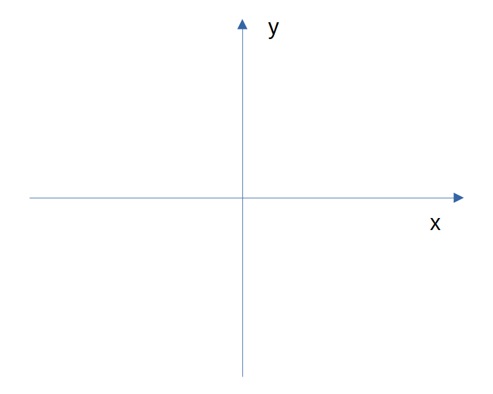

[Home](https://mgcodesandstats.github.io/) |
[GitHub](https://github.com/mgcodesandstats) |
[LinkedIn](https://www.linkedin.com/in/michaeljgrogan/) |
[Terms](https://mgcodesandstats.github.io/terms/) |
[E-mail](mailto:contact@michael-grogan.com)

# Rejection Sampling in Python

Rejection sampling is a means of generating random numbers that belong to a particular distribution.

For instance, let’s say that one wishes to generate 1,000 random numbers that follow a normal distribution. If one wishes to do this in Python using numpy, it is quite a simple execution:

```
np.random.randn(1000)
```

How exactly does this process work? Upon generating random numbers in Python, how can an algorithm know whether a random number belongs to a particular distribution or not? This is where rejection sampling comes in.

## Uniform Random Numbers

A Cartesian graph consists of x and y-axes across a defined space.



*Source: Image Created by Author*

Across the area of the graph, a given distribution (such as a normal distribution) can only cover a given section of the graph. In this regard, if one were to randomly throw darts at the board, then the darts that fell within the area of the normal distribution would be accepted, while those outside of that area would be rejected.

Let’s see how this works using Python.

The first thing to do is properly define the probability density function. When referring to the scipy.org manual, the probability density function for norm is provided.

This is defined in Python as follows:

```
f=lambda x: np.exp(-(x**2)/2)/(sqrt(2*3.14))
```

José Unpingco’s Python for Probability, Statistics and Machine Learning (2016) gives a detailed overview of rejection sampling and other probability methods, and I would recommend this title for a deeper understanding of this topic. Unpingco uses the rejection method to identify samples for both a density that does not have a continuous inverse, and for the chi-square distribution.

In this case, I am defining the densities for the Normal and Cauchy distributions instead, along with making different assumptions for the scale across the random numbers u1 and u2. However, the ultimate aim of the analysis remains the same — use u1 to select random numbers across the domain of f(x), and then u2 accepts or rejects the values based on the following criteria:

```
idx,=np.where(u2<=f(u1)/M) # rejection criterion
```

A scale of **0.3** is selected, and the random samples of u1 and u2 are generated.

```
M=0.3 #scale factor
Mu1=np.random.rand(10000)*3  # uniform random samples scaled out
u2=np.random.rand(10000)    # uniform random samplesidx,=np.where(u2<=f(u1)/M)
```

v samples are generated based on the rejection criterion:

```
>>> v=u1[idx]
>>> v

array([0.00879322, 0.19344109, 0.53193192, ..., 0.45176108, 0.78405714, 0.85680125])
```


*Source: Jupyter Notebook Output*

Here, we can see that the samples that follow the normal distribution are highlighted in orange.

## Efficiency Ratio

One thing we would like to know is the **efficiency ratio** — i.e. what proportion of the random numbers generated actually belong to the defined distribution?

```
>>> u1_size=u1.size
>>> v_size=v.size

>>> u1_size
10000
>>> v_size
4931

>>> efficiency=v_size/u1_size
>>> efficiency
0.4931
```

Based on the above, **49.31%** of the generated samples fall under the area of the normal distribution. This means that half of the samples generated are being discarded.

What if the scale is decreased to 0.1?


*Source: Jupyter Notebook Output*

In this case, the normal distribution covers more of the overall area and less samples are being discarded.

The efficiency also increases to **71.24%**.

## Defining different probability densities

While scaling can help in increasing the efficiency, the ideal scenario would be to identify a different distribution that has a higher efficiency.

Let’s try the Cauchy distribution — which is similar to that of a normal distribution but has heavier tails.

The probability density function for the Cauchy Distribution is defined as follows:

```
f=lambda x: 1/(3.14*(1+x**2))
```

A scale of 0.1 is set for M once again.


*Source: Jupyter Notebook Output*

```
>>> u1_size=u1.size
>>> v_size=v.size
>>> efficiency=v_size/u1_size
>>> efficiency
0.7871
```

The efficiency has increased to 78.71% — indicating that the Cauchy distribution is better suited to modelling the given data — with the longer tails of the distribution covering a larger area.

## Conclusion

Rejection sampling (also known as the acceptance-rejection algorithm) is a key tool in the field of probability for generating random numbers that comply with a particular distribution.

In this example, you have seen:

- How to define a probability density function using scipy
- Defining a rejection criterion for the random samples
- Sampling of different distributions to increase efficiency

Many thanks for your time, and any questions or feedback are greatly welcomed.

*Disclaimer: This article is written on an “as is” basis and without warranty. It was written with the intention of providing an overview of data science concepts, and should not be interpreted as professional advice. The findings and interpretations in this article are those of the author and are not endorsed by or affiliated with any third-party mentioned in this article.*

## References

- José Unpingco (2016). Python for Probability, Statistics and Machine Learning
- scipy.org: Statistical Functions (scipy.stats)
