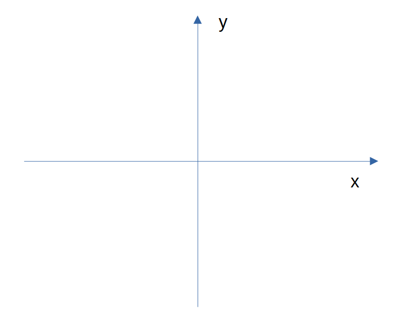
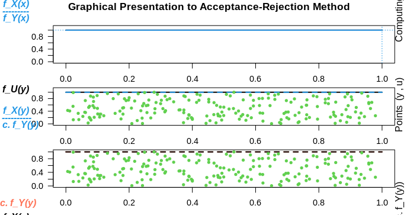
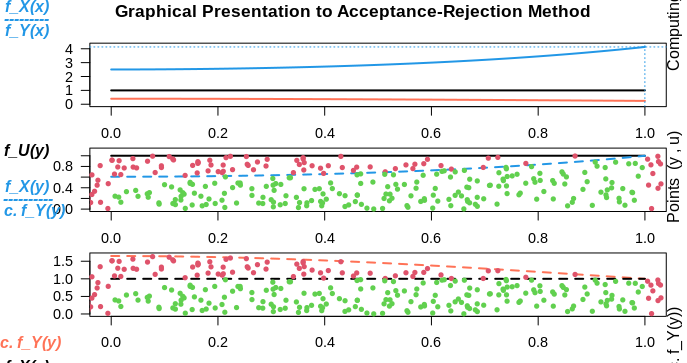
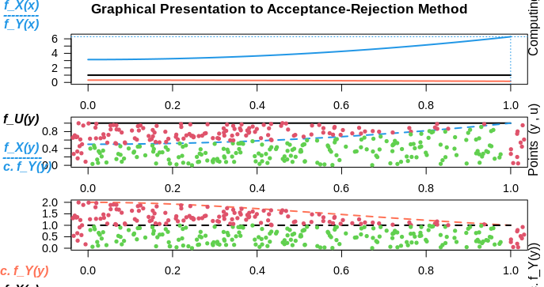
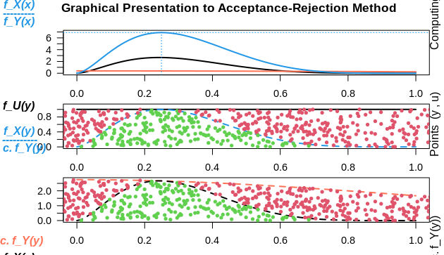

[Home](https://mgcodesandstats.github.io/) |
[GitHub](https://github.com/mgcodesandstats) |
[LinkedIn](https://www.linkedin.com/in/michaeljgrogan/) |
[Terms](https://mgcodesandstats.github.io/terms/) |
[E-mail](mailto:contact@michael-grogan.com)

# Rejection Sampling in R

When generating random numbers from a particular distribution, this process can be automated to a large extent.

For instance, if one wants to generate 100 random numbers that belong to a normal distribution in R, it is as simple as executing:

```rnorm(100)```

However, how does this process actually work "under the hood"? How can an algorithm know whether a random number belongs to a particular distribution or not?

The answer is through **rejection sampling**.

Rejection sampling is a means of generating random numbers that belong to a particular distribution.

## How Rejection Sampling Works

A Cartesian graph consists of x and y-axes across a defined space.



*Source: Image Created by Author*

Across the area of the graph, a given distribution (such as a normal distribution) can only cover a given section of the graph. In this regard, if one were to randomly throw darts at the board, then the darts that fell within the area of the normal distribution would be accepted, while those outside of that area would be rejected.

## Use of the AR Package

While setting this mechanism up manually could prove to be a cumbersome process, the [AR package](https://cran.r-project.org/web/packages/AR/AR.pdf) in R makes this much more intuitive.

For reference, AR stands for **acceptance-rejection method**, which essentially means that the algorithm accepts random numbers that fit within a specified distribution, while rejecting those that do not.

Let's take a look at some examples.

### Defining y function as a uniform distribution

Firstly, let's consider a uniform distribution with random numbers bounded between 0 and 1.

```
library(AR)

simulation = AR.Sim( n = 200,
               f_X = function(y){dunif(y, min = 0, max = 1, log = FALSE)},
               Y.dist = "unif", Y.dist.par = c(0,1),
               Rej.Num = TRUE,
               Rej.Rate = TRUE,
               Acc.Rate = FALSE
)

simulation
```

In this example, the function (y) is defined as the uniform distribution ```dunif(y, min = 0, max = 1, log = FALSE)```, with *Y.dist* also set to uniform ```unif``` - where *Y.dist* stands for the distribution name of the random variables, i.e. we are specifying that all random numbers generated should be uniform.

Here is the generated simulation:

```
Optimal c = 1
The numbers of Rejections = 0
Ratio of Rejections = 0
> data
  [1] 0.698931268 0.385566025 0.268550105 0.645668389
  [5] 0.074197359 0.106701437 0.413400215 0.852781124
...
[193] 0.170901990 0.846563826 0.935788635 0.794019386
[197] 0.954960048 0.185282641 0.262304122 0.499565325
```

Given that the generated random numbers are from the same distribution, then the rejection rate is 0, i.e. all generated random numbers fall within the specified distribution.

Here is a graphical presentation, whereby we see that all random numbers are highlighted in green - they all fall under the acceptance region:



However, when the random numbers are sampled from a different distribution, we can expect that the rejection rate will be significant, as it is inevitable that the uniformly generated random numbers will fall outside the distribution.

Let's specify *Y.dist* as a normal distribution.

```
data = AR.Sim( n = 200,
               f_X = function(y){dunif(y, min = 0, max = 1, log = FALSE)},
               Y.dist = "norm", Y.dist.par = c(0,1),
               Rej.Num = TRUE,
               Rej.Rate = TRUE,
               Acc.Rate = FALSE
)
data
```

Here is the generated sample and rejection score.

```
Optimal c = 4.132
The numbers of Rejections = 646
Ratio of Rejections = 0.764
> data
  [1] 0.928162718 0.263720941 0.791635163 0.787643782
  [5] 0.682266914 0.609826459 0.526126303 0.303784735
...
[193] 0.528860424 0.945110000 0.263584707 0.958508588
[197] 0.136600285 0.855113058 0.952162865 0.776729036
```

We see that a rejection rate of over **76%** is obtained in this case, meaning that 76% of the generated samples are rejected.

Here is a graphical representation:



How about a Cauchy distribution?

```
data = AR.Sim( n = 200,
               f_X = function(y){dunif(y, min = 0, max = 1, log = FALSE)},
               Y.dist = "cauchy", Y.dist.par = c(0,1),
               Rej.Num = TRUE,
               Rej.Rate = TRUE,
               Acc.Rate = FALSE
)
data
```

In this case, a significantly higher rejection rate of 83.9% is observed:

```
Optimal c = 6.283
The numbers of Rejections = 1042
Ratio of Rejections = 0.839
> data
  [1] 0.942316029 0.610005076 0.653872133 0.411678591
  [5] 0.350234804 0.511995680 0.962110053 0.224207609
...
[193] 0.320808401 0.788250465 0.805645829 0.214475551
[197] 0.471248814 0.015849055 0.715283175 0.067130172
```

Once again, here is a graphical representation:



In addition, it is also possible to change the distribution that the random numbers themselves are generated from.

### Defining y function as a beta distribution

While a uniform distribution has been selected here, the original author chose to define the y function as a beta distribution instead.

When random numbers belonging to the normal distribution were sampled from a uniform distribution in this case, the rejection rate was **76.4%**.

What if the y function was instead defined as a beta distribution? In attempting to identify normally distributed random numbers from this distribution, would a lower or higher rejection rate be observed?

```
data = AR.Sim( n = 200,
               f_X = function(y){dbeta(y,2.7,6.3)},
               Y.dist = "norm", Y.dist.par = c(0,1),
               Rej.Num = TRUE,
               Rej.Rate = TRUE,
               Acc.Rate = FALSE
)
data
```

Here are the samples and rejection rate:

```
Optimal c = 6.898
The numbers of Rejections = 1231
Ratio of Rejections = 0.86
> data
  [1] 0.36115666 0.41559791 0.38940239 0.36566013 0.60793899
  [6] 0.25795174 0.10902713 0.27325963 0.64264824 0.18258016
...
[191] 0.12631125 0.26920790 0.13224107 0.33171854 0.08197576
[196] 0.22850070 0.41424580 0.34925813 0.13344548 0.57013744
```

In this case, the rejection rate of **86%** is significantly higher when sampling from the beta distribution, implying that it is slightly more efficient to sample from the uniform distribution (at least when attempting to generate normally distributed random numbers from this distribution).



## Conclusion

Rejection sampling (also known as the acceptance-rejection algorithm) is a key tool in the field of probability for generating random numbers that comply with a particular distribution.

In this example, you have seen:

- What is rejection sampling and its importance in generating random numbers that belong to a particular distribution
- How to use the AR package in R for this purpose
- Sampling of different distributions to increase efficiency

Many thanks for your time, and any questions or feedback are greatly welcomed.

*Disclaimer: This article is written on an “as is” basis and without warranty. It was written with the intention of providing an overview of data science concepts, and should not be interpreted as professional advice. The findings and interpretations in this article are those of the author and are not endorsed by or affiliated with any third-party mentioned in this article.*

## References

- José Unpingco (2016). Python for Probability, Statistics and Machine Learning
- [The Comprehensive R Archive Network: Package 'AR'](https://cran.r-project.org/web/packages/AR/AR.pdf)
